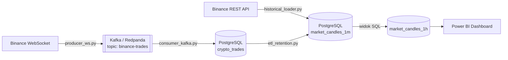

# Krypto Data Engineer — real-time pipeline z Binance do Power BI

Pipeline danych kryptowalutowych: strumień transakcji z Binance WebSocket →
Kafka/Redpanda → PostgreSQL → agregacje SQL → dashboard Power BI z
dynamicznym przełącznikiem granularności czasu (godzina/dzień/miesiąc/rok).

## Architektura



## Struktura repo

```
krypto-data-engineer/
├── docker-compose.yml      # Postgres + Redpanda jedną komendą
├── requirements.txt
├── .env.example             # skopiuj do .env i uzupełnij lokalnie
├── sql/
│   └── schema.sql           # tabele + widok market_candles_1h
├── pipeline/
│   ├── db.py                 # wspólna konfiguracja połączenia (z .env)
│   ├── historical_loader.py  # jednorazowe wypełnienie 7 dni historii
│   ├── producer_ws.py        # Binance WebSocket -> Kafka
│   ├── consumer_kafka.py     # Kafka -> Postgres
│   └── etl_retention.py      # agregacja + retencja, cyklicznie
├── powerbi/
│   ├── Krypto_data_engineer.pbix
│   └── INSTRUKCJA_POWERBI.md # jak działa dynamiczny slicer "Okno czasowe"
└── docs/
    └── screenshots/          # zrzuty dashboardu
```

## Uruchomienie lokalne

### 1. Infrastruktura (Postgres + Redpanda)

```bash
cp .env.example .env
docker compose up -d
```

Sprawdź, czy oba kontenery wstały: `docker ps` — powinieneś zobaczyć
`crypto-postgres` i `redpanda-broker`. `schema.sql` uruchamia się
automatycznie przy pierwszym starcie Postgresa (przez
`docker-entrypoint-initdb.d`).

### 2. Zależności Pythona

```bash
python -m venv .venv
source .venv/bin/activate   # Windows: .venv\Scripts\activate
pip install -r requirements.txt
```

### 3. Historia danych (jednorazowo)

```bash
cd pipeline
python historical_loader.py
```

### 4. Stream na żywo

W dwóch osobnych terminalach (albo notebookach — oba działają w
nieskończonej pętli, więc nie mieszaj ich z resztą kodu w jednym miejscu):

```bash
python producer_ws.py
python consumer_kafka.py
```

Oba mają wbudowany limit (`MAX_MESSAGES=500` / `MAX_RUNTIME_SEC=300`), więc
zatrzymują się same — nie zasypią dysku ani nie będą ciągnąć całego Binance
bez końca. Zmień te stałe na górze plików, jeśli chcesz dłuższy zbiór danych.

### 5. ETL + retencja

```bash
python etl_retention.py
```

Uruchamiaj cyklicznie (cron / Task Scheduler), żeby dane w
`market_candles_1h` (i sam dashboard) były na bieżąco.

### 6. Power BI

Otwórz `powerbi/Krypto_data_engineer.pbix`, odśwież dane. Szczegóły
działania dynamicznego przełącznika granularności ("Okno czasowe") — patrz
`powerbi/INSTRUKCJA_POWERBI.md`.


## Dashboard


## Bezpieczeństwo / dobre praktyki

- Żadne hasła nie są zapisane na sztywno w kodzie — wszystko czytane z
  `.env` (patrz `pipeline/db.py`). Plik `.env` jest w `.gitignore` i nigdy
  nie trafia do repo.
- Limity w producerze/konsumencie zapobiegają niekontrolowanemu wzrostowi
  danych przy pracy lokalnej/testowej.
- `market_candles_1h` to widok SQL (nie tabela) — zawsze aktualny, bez
  duplikacji danych.
